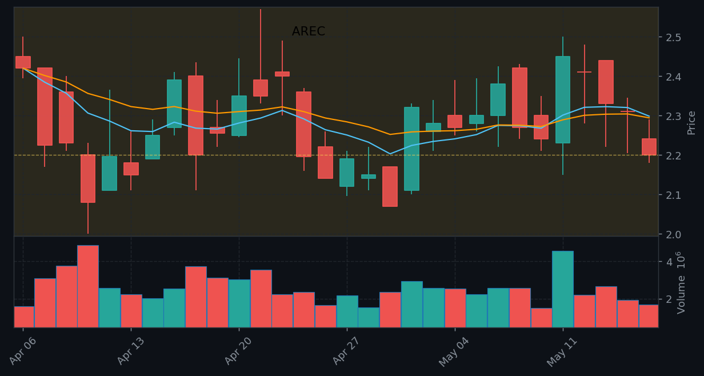

# Catalyst Report — Monday, May 18, 2026

## Earnings

| WHEN | TICKER | TIME | EXP MOVE | EPS EST | EPS PREV |
|------|--------|------|----------|---------|----------|
| AMC | **AREC** | AMC | ±36.4% | -0.13 | — |

### AREC — AMC — Exp Move ±36.4%

## Economic Events

| IMPACT | EVENT | TIME | PREV | FORECAST |
|--------|-------|------|------|----------|
| 🟡 MED | TIC Net Long-Term Transactions  (Mar) | 4:00pm | 58.6B | — |

## FDA / Biotech

_No upcoming FDA events in the next 7 days._

## Unusual Options Activity

| TICKER | TYPE | STRIKE | EXPIRY | VOL/OI | PREMIUM |
|--------|------|--------|--------|--------|---------|
| **NVDA** | PUT | $225 | 2026-06-12 | 4.2x | $2.2M |
| **NU** | PUT | $12 | 2026-06-12 | 18.4x | $170K |
| **INTC** | CALL | $126 | 2026-06-12 | 3.4x | $262K |
| **INTC** | PUT | $129 | 2026-06-12 | 3.1x | $918K |
| **F** | CALL | $5 | 2026-06-12 | 5.3x | $538K |
| **F** | PUT | $19 | 2026-06-12 | 4.6x | $53K |
| **POET** | PUT | $16 | 2026-06-12 | 69.1x | $452K |
| **FIG** | CALL | $23 | 2026-06-12 | 35.6x | $139K |
| **TSLA** | CALL | $435 | 2026-06-12 | 13.2x | $10.5M |
| **TSLA** | PUT | $470 | 2026-06-12 | 4.2x | $114K |

## Watchlist

| TICKER | CHANGE |
|--------|--------|
| SPY | -1.2% |
| QQQ | -1.5% |
| NVDA | -4.4% |
| TSLA | -4.8% |
| AAPL | +0.7% |
| MSFT | +3.1% |
| AMD | -5.7% |
| META | -0.7% |
| AMZN | -1.2% |
| GOOGL | -1.1% |
